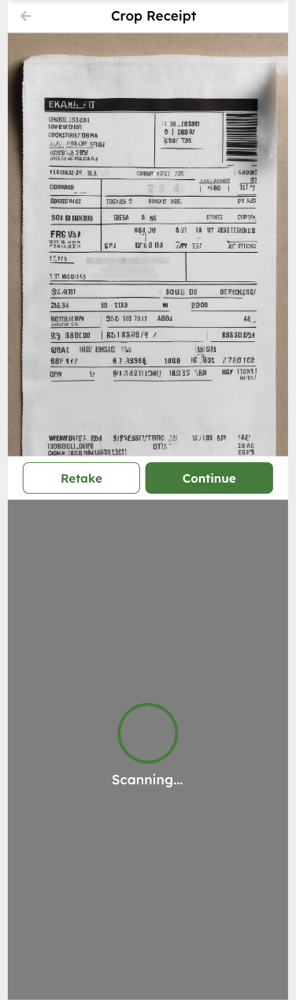

Original App Design Project - README
===

# Carbon Tracker (OCR App)

## Table of Contents
1. [Overview](#overview)  
2. [Product Spec](#product-spec)  
3. [Wireframes](#wireframes)  
4. [Schema](#schema)  

---

## Overview

### Description
**Carbon Tracker** lets users estimate the carbon footprint of a purchase by snapping a photo of the paper receipt. The app guides the user to (1) capture the receipt, (2) crop to the receipt area, (3) run on‑device OCR to extract the list of items, and (4) (stretch) calculate and display the total carbon impact.

### App Evaluation
| Attribute | Notes |
|-----------|-------|
| **Category** | Sustainability / Utility |
| **Mobile** | Uses camera, image cropping, and on‑device ML — a naturally mobile‑first experience |
| **Story** | Makes it effortless for shoppers to understand and reduce their environmental impact |
| **Market** | Eco‑conscious consumers, climate‑focused NGOs, green loyalty programs |
| **Habit** | Can become a post‑purchase routine; receipts are plentiful and repetitive |
| **Scope** | MVP: camera → crop → OCR; Stretch: carbon computation, history log, insights dashboard |

---

## Product Spec

### 1. User Stories

**Required (Must‑have)**  
- [ ] User can open the camera and take a photo of a receipt  
- [ ] User can crop the photo to the receipt region  
- [ ] App runs OCR and shows recognized line items  

**Optional (Nice‑to‑have)**  
- [ ] App fetches carbon‑intensity data and shows total footprint per receipt  
- [ ] User can reset and scan another receipt  
- [ ] History screen with past scans and trends  
- [ ] Share results (image/text) to social media  

### 2. Screen Archetypes
- **Camera Screen**  
  * Capture receipt photo  ↔  *“take photo”* story  
- **Crop Screen**  
  * Drag handles to crop image  ↔  *“crop receipt”* story  
- **Results Screen**  
  * Display OCR‑parsed items (and, optionally, carbon totals)  ↔  *“show recognized items / footprint”* stories  
- **History Screen** *(optional)*  
  * List of prior scans with summary stats  

### 3. Navigation
**Tab Navigation**  
* Scan  
* History *(optional)*  
* Settings *(optional)*  

**Flow Navigation**  
1. **Camera Screen** → **Crop Screen** (after photo captured)  
2. **Crop Screen** → **Results Screen** (after confirm)  
3. **Results Screen** → **Camera Screen** (tap “Reset / Scan New”)  
4. Global tab bar to **History** or **Settings** at any time (if implemented)  

---

## Wireframes
_Add a picture of your hand‑sketched wireframes here_  

### [BONUS] Digital Wireframes & Mockups
### [BONUS] Interactive Prototype

---

### Networking
- **Camera / Crop / Results**  
  * No network calls required for on‑device OCR (MVP)  
  * (Stretch) `POST /carbon` – send items list, receive carbon totals
    
*(Endpoints are illustrative; actual implementation TBD.)*

---

## License

Copyright 2025 Rishabh Rao

Licensed under the Apache License, Version 2.0 (the “License”); you may not use this file except in compliance with the License. You may obtain a copy of the License at

    http://www.apache.org/licenses/LICENSE-2.0

Unless required by applicable law or agreed to in writing, software distributed under the License is distributed on an “AS IS” BASIS, WITHOUT WARRANTIES OR CONDITIONS OF ANY KIND, either express or implied. See the License for the specific language governing permissions and limitations under the License.
